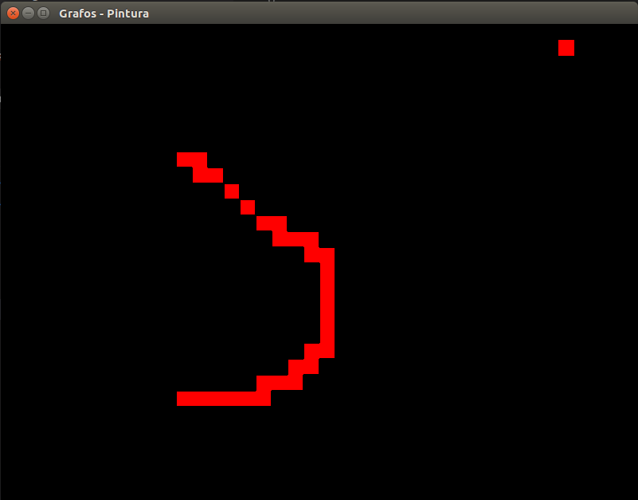
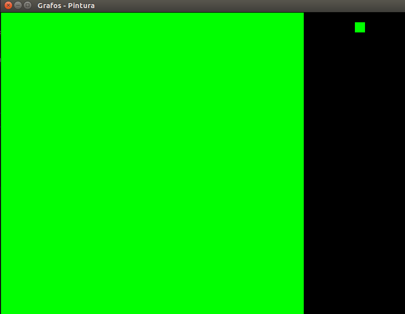
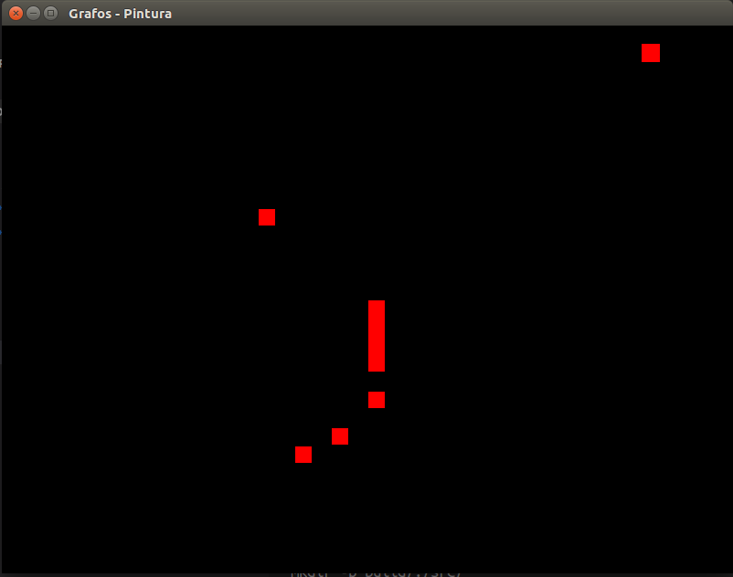
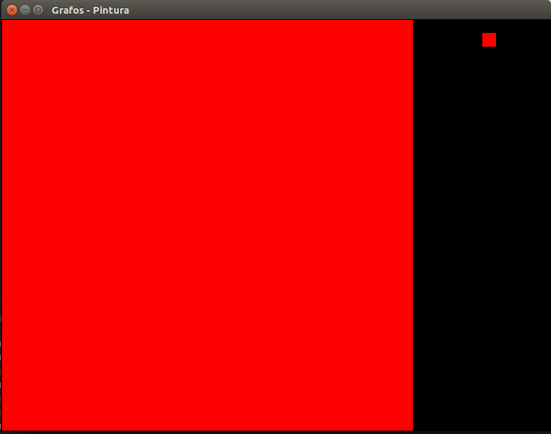
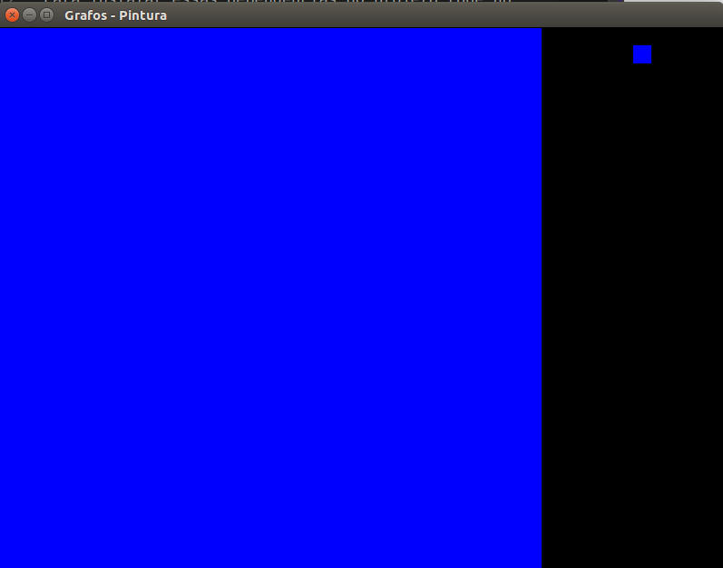

# Trabalho de Grafos 1 - Flood & Fill

## **Alunos**
* Nome: Guilherme Guy - Matrícula: 16/0123186
* Nome: Joberth Rogers - Matrícula: 16/0128013

## Instalando dependências

As dependências usadas no projeto são:
* SFML

Para instalar essas depêndencias do projeto rode no terminal o comando:
    
    sudo apt install libsfml-dev

## Rodando o projeto

Para executar o projeto use o comando:
    
    make all

## Comandos usados na execução

Para interafir com o programa é preciso saber de alguns comandos essênciais são eles:

* **Tecla "1"** : modo pincel

* **Tecla "2"**: modo bucket

* **Tecla "2"**: Borracha

* **Tecla "barra de espaço"**: Muda de cor

* **Teclas "Q e W"**: Diminuir e aumenta a velocidade das iterações em ms respectivamente 

